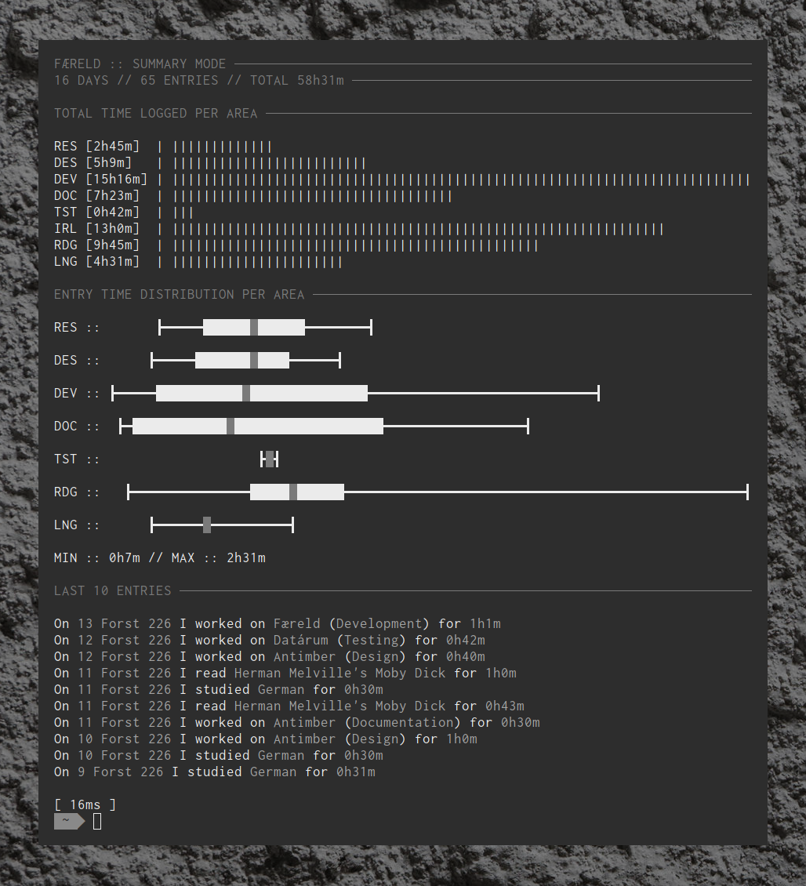

========
Overview
========

Færeld is a tool to facilitate time tracking of what I'm working on.
The goal is to then visualise this data in Hrǽw and use that to examine and
optimise what I spend my time on.

Contents
--------

.. _installation:

.. toctree::
   :maxdepth: 2
   :caption: Installation

   installation/index

.. _usage:

.. toctree::
   :maxdepth: 2
   :caption: Usage

   usage/modes
   usage/areas
   usage/configuration
